---
{"dg-publish":true,"permalink":"/100-degenesis-garden/culti/anabattisti/"}
---

# Anabattisti
**LE GUIDE NEL PARADISO**

https://drive.google.com/drive/folders/1WWMS4hx1hWbTlbkAhZHRKYJICSxCOelQ?usp=sharing
### Filosofia e Credo: La Neognosi
Gli Anabattisti si vedono come i prescelti impegnati in una battaglia cosmica per la salvezza dell'umanità e la restaurazione del Paradiso perduto. Il loro credo, fondato da **Rebus il Battista**, si basa sulla **Neognosi**.
* **Dualismo:** Credono che in origine esistesse una separazione tra il **Pneuma** (il respiro divino, puro e buono) e la materia (oscura e malvagia). Il **Demiurgo**, un'entità corrotta, mescolò i due principi creando il mondo materiale, intrappolando lo spirito divino in "prigioni di carne" (i corpi umani).
* **L'Eshaton:** Vedono l'apocalisse non come una fine, ma come un atto di pietà di Dio per distruggere il Demiurgo e dare all'umanità un'ultima possibilità di dimostrare il proprio valore combattendo la corruzione.
* **Il Paradiso Marcio:** Credono che la Terra sia il Paradiso, ma che sia malato, avvelenato e in decomposizione. Il loro compito è curare la terra tramite l'agricoltura e purificarla distruggendo le creature del Demiurgo.

---
### Struttura del Culto: I Due Cuori
La società anabattista è divisa in due caste principali, entrambe essenziali ma con approcci opposti alla vita e alla fede:
1. **Asceti (Contadini):** Si dedicano alla cura della terra. Coltivano i campi per sfamare il Culto e guarire il suolo avvelenato. Credono nella mortificazione della carne, sopprimendo i bisogni fisici e sessuali per avvicinarsi al Pneuma attraverso la sofferenza e la meditazione.
2. **Orgiastici (Guerrieri):** Proteggono i campi e combattono i nemici della fede. Al contrario degli Asceti, credono che lo spirito sia superiore alla carne e sfogano i loro impulsi umani attraverso eccessi di violenza, alcool e sesso (orge), liberando la mente tramite l'estasi della battaglia.

### Rituali e Pratiche
*  **Olii Elisi:** Il Culto produce olii speciali (basati sulle formule di Rebus) che vengono spalmati sul corpo e sui capelli. Questi olii hanno proprietà psicotrope e stimolanti: donano vigore, scacciano il dolore e avvicinano i fedeli al "regno dei cieli".
*  **Emanazioni:** La gerarchia si basa sulla capacità di avere intuizioni divine o visioni, chiamate "emanazioni". Chi dimostra di possedere il "Seme" dell'intuizione viene elevato ai ranghi superiori.
*  **Simboli:** Il loro simbolo è una **croce con una ruota spezzata**, che rappresenta l'imperfezione della creazione materiale. Gli iniziati portano un anello al naso (simbolo della schiavitù al corpo) e tre punti tatuati sulla fronte.
*  **Battaglie:** Considerano gli Psiconauti e la Sepsi come manifestazioni dirette del Demiurgo. La loro lotta contro di essi è totale e priva di pietà, condotta spesso con l'uso di lanciafiamme (**Sputafuoco**) per purificare l'infezione.

---
### Organizzazione e Luoghi
*   **Città Cattedrale:** Il cuore del potere Anabattista si trova nella Borca occidentale, in un'antica cattedrale (probabilmente Colonia) strappata ai Cronisti secoli fa. La città è famosa per i suoi acquedotti e le sue coltivazioni.

```mermaid
graph LR
    %% Definizione Nodi
    N1((1)) --- SFIORATO[SFIORATO]

    %% Bivio iniziale
    SFIORATO --- N2A((2))
    SFIORATO --- N2B((2))

    N2A --- ORGIASTICO[ORGIASTICO]
    N2B --- ASCETA[ASCETA]

    %% Livello 3
    ORGIASTICO --- N3A((3))
    ASCETA --- N3B((3))

    N3A --- FURORE[FURORE]
    N3B --- ELISIO[ELISIO]

    %% L'incrocio centrale (X)
    FURORE --- N4A((4))
    FURORE --- N4B((4))
    ELISIO --- N4A
    ELISIO --- N4B

    %% Livello 4 e oltre
    N4A --- SUBLIME[SUBLIME]
    N4B --- EMISSARIO[EMISSARIO]

    SUBLIME --- N5A((5))
    N5A --- ACHERONTE[ACHERONTE]

    EMISSARIO --- N5B((5))
    N5B --- CONSIGLIERE[CONSIGLIERE]
    
    CONSIGLIERE --- N6((6))
    N6 --- BATTISTA[BATTISTA]

    %% Styling per somigliare all'immagine
    style SFIORATO fill:#000,color:#fff,stroke:#fff
    style ORGIASTICO fill:#000,color:#fff,stroke:#fff
    style ASCETA fill:#000,color:#fff,stroke:#fff
    style FURORE fill:#000,color:#fff,stroke:#fff
    style ELISIO fill:#000,color:#fff,stroke:#fff
    style SUBLIME fill:#000,color:#fff,stroke:#fff
    style EMISSARIO fill:#000,color:#fff,stroke:#fff
    style ACHERONTE fill:#000,color:#fff,stroke:#fff
    style CONSIGLIERE fill:#000,color:#fff,stroke:#fff
    style BATTISTA fill:#000,color:#fff,stroke:#fff
```

#####

---
### Relazioni Esterne
*   **Spitaliani:** Sono i loro alleati più stretti. Sebbene gli Anabattisti li considerino privi di spiritualità, rispettano la loro efficacia nella lotta contro la Sepsi e gli Psiconauti.
*   **Jehammediani:** Sono i loro storici arcinemici. Il conflitto tra i due culti è visto come una riedizione biblica dello scontro tra Caino (l'agricoltore/Anabattista) e Abele (il pastore/Jehammediano).
*   **Chronicler:** Un tempo nemici mortali (dopo la conquista della Cattedrale), ora vivono una tregua fragile, vedendo la tecnologia come una corruzione necessaria per combattere il male maggiore.