---
{"dg-publish":true,"dg-path":"Culti/Anabattisti.md","permalink":"/culti/anabattisti/"}
---

# Anabattisti - Le guide nel Paradiso

> [!metadata] **[Galleria](https://drive.google.com/drive/folders/1WWMS4hx1hWbTlbkAhZHRKYJICSxCOelQ?usp=sharing)** 

### Filosofia e Credo: La Neognosi
Gli Anabattisti si vedono come i prescelti impegnati in una battaglia cosmica per la salvezza dell'umanità e la restaurazione del Paradiso perduto. Il loro credo, fondato da **Rebus il Battista**, si basa sulla **Neognosi**.
* **Dualismo:** Credono che in origine esistesse una separazione tra il **Pneuma** (il respiro divino, puro e buono) e la materia (oscura e malvagia). Il **Demiurgo**, un'entità corrotta, mescolò i due principi creando il mondo materiale, intrappolando lo spirito divino in "prigioni di carne" (i corpi umani).
* **L'Eshaton:** Vedono l'apocalisse non come una fine, ma come un atto di pietà di Dio per distruggere il Demiurgo e dare all'umanità un'ultima possibilità di dimostrare il proprio valore combattendo la corruzione.
* **Il Paradiso Marcio:** Credono che la Terra sia il Paradiso, ma che sia malato, avvelenato e in decomposizione. Il loro compito è curare la terra tramite l'agricoltura e purificarla distruggendo le creature del Demiurgo.

---
### Struttura del Culto: I Due Cuori
La società anabattista è divisa in due caste principali, entrambe essenziali ma con approcci opposti alla vita e alla fede:
1. **Asceti (Contadini):** Si dedicano alla cura della terra. Coltivano i campi per sfamare il Culto e guarire il suolo avvelenato. Credono nella mortificazione della carne, sopprimendo i bisogni fisici e sessuali per avvicinarsi al Pneuma attraverso la sofferenza e la meditazione.
2. **Orgiastici (Guerrieri):** Proteggono i campi e combattono i nemici della fede. Al contrario degli Asceti, credono che lo spirito sia superiore alla carne e sfogano i loro impulsi umani attraverso eccessi di violenza, alcool e sesso (orge), liberando la mente tramite l'estasi della battaglia.

### Rituali e Pratiche
*  **Olii Elisi:** Il Culto produce olii speciali (basati sulle formule di Rebus) che vengono spalmati sul corpo e sui capelli. Questi olii hanno proprietà psicotrope e stimolanti: donano vigore, scacciano il dolore e avvicinano i fedeli al "regno dei cieli".
*  **Emanazioni:** La gerarchia si basa sulla capacità di avere intuizioni divine o visioni, chiamate "emanazioni". Chi dimostra di possedere il "Seme" dell'intuizione viene elevato ai ranghi superiori.
*  **Simboli:** Il loro simbolo è una **croce con una ruota spezzata**, che rappresenta l'imperfezione della creazione materiale. Gli iniziati portano un anello al naso (simbolo della schiavitù al corpo) e tre punti tatuati sulla fronte.
*  **Battaglie:** Considerano gli Psiconauti e la Sepsi come manifestazioni dirette del Demiurgo. La loro lotta contro di essi è totale e priva di pietà, condotta spesso con l'uso di lanciafiamme (**Sputafuoco**) per purificare l'infezione.

---
### Organizzazione 
*   **Città Cattedrale:** Il cuore del potere Anabattista si trova nella Borca occidentale, in un'antica cattedrale (probabilmente Colonia) strappata ai Cronisti secoli fa. La città è famosa per i suoi acquedotti e le sue coltivazioni.

```mermaid
graph LR
    %% Definizione Nodi
    N1((1)) --- SFIORATO[SFIORATO]

    %% Bivio iniziale
    SFIORATO --- N2A((2))
    SFIORATO --- N2B((2))

    N2A --- ORGIASTICO[ORGIASTICO]
    N2B --- ASCETA[ASCETA]

    %% Livello 3
    ORGIASTICO --- N3A((3))
    ASCETA --- N3B((3))

    N3A --- FURORE[FURORE]
    N3B --- ELISIO[ELISIO]

    %% L'incrocio centrale (X)
    FURORE --- N4A((4))
    FURORE --- N4B((4))
    ELISIO --- N4A
    ELISIO --- N4B

    %% Livello 4 e oltre
    N4A --- SUBLIME[SUBLIME]
    N4B --- EMISSARIO[EMISSARIO]

    SUBLIME --- N5A((5))
    N5A --- ACHERONTE[ACHERONTE]

    EMISSARIO --- N5B((5))
    N5B --- CONSIGLIERE[CONSIGLIERE]
    
    CONSIGLIERE --- N6((6))
    N6 --- BATTISTA[BATTISTA]

    %% Styling per somigliare all'immagine
    style SFIORATO fill:#000,color:#fff,stroke:#fff
    style ORGIASTICO fill:#000,color:#fff,stroke:#fff
    style ASCETA fill:#000,color:#fff,stroke:#fff
    style FURORE fill:#000,color:#fff,stroke:#fff
    style ELISIO fill:#000,color:#fff,stroke:#fff
    style SUBLIME fill:#000,color:#fff,stroke:#fff
    style EMISSARIO fill:#000,color:#fff,stroke:#fff
    style ACHERONTE fill:#000,color:#fff,stroke:#fff
    style CONSIGLIERE fill:#000,color:#fff,stroke:#fff
    style BATTISTA fill:#000,color:#fff,stroke:#fff
```

##### Rango 1: L'Ingresso

- **Sfiorato (Touched):** Chiunque senta la "chiamata" può unirsi agli Anabattisti per un periodo di prova. Durante il primo anno, vivono ai margini della comunità, lavorando e osservando. Possono lasciare il culto liberamente o impegnarsi definitivamente facendosi battezzare.
    - **Segni distintivi:** Se accettano il battesimo, ricevono un anello al naso (simbolo della schiavitù del corpo) e tre punti tatuati sulla fronte.

##### Rango 2: La Scelta del Cammino

A questo punto, l'Anabattista deve scegliere come servire: attraverso la sofferenza del lavoro o l'estasi della battaglia.

- **Asceta (Ascetic):** Sono i lavoratori e i contadini. Credono che il Paradiso sia morto e avvelenato e che il loro sudore e la loro fatica siano necessari per curarlo.
    - **Filosofia:** Disprezzano il proprio corpo come una prigione di carne corrotta. Sopprimono ogni bisogno fisico e sessuale, cercando l'illuminazione attraverso il dolore e la meditazione notturna dopo il duro lavoro nei campi. Sono la spina dorsale economica del Culto,.
- **Orgiastico (Orgiastic):** Sono i guerrieri. Al contrario degli Asceti, credono che lo spirito sia superiore alla carne e che i bisogni fisici vadano sfogati, non soppressi.
    - **Filosofia:** Utilizzano gli Olii Elisi (sostanze psicotrope e stimolanti) per entrare in una furia berserk in battaglia. Vivono di eccessi, violenza e orge, convinti che questo liberi la mente per avvicinarsi al divino. Proteggono i campi e attaccano gli Psiconauti,.

##### Rango 3: La Specializzazione

- **Elisio (Elysian) (Evoluzione dell'Asceta):** Sono i sapienti, i medici e gli alchimisti del Culto. Hanno una profonda conoscenza della natura e della Sepsi.
    - **Ruolo:** Lavorano nei frantoi per creare gli olii sacri, curano i feriti in battaglia e ungono i moribondi. Sanno distinguere le erbe benefiche da quelle velenose e combattono la corruzione a livello biologico.
- **Furore (Fury) (Evoluzione dell'Orgiastico):** Guerrieri veterani che si sono distinti per coraggio e fede incrollabile.
    - **Privilegi:** Hanno accesso alle catacombe proibite sotto Città Cattedrale e agli arsenali antichi (spesso tecnologia dei Cronisti "purificata"). Sono gli unici autorizzati a usare armi speciali come i lanciafiamme (**Sputafuoco**) per incenerire le spore e gli Aberranti.

##### Rango 4: La Leadership

- **Emissario (Emissary):** Coloro che hanno ottenuto purezza mentale attraverso la mortificazione della carne. Vedono i "fili della vita" che collegano il Culto.
    - **Ruolo:** Sono i diplomatici e i coordinatori. Viaggiano per le terre desolate, negoziano con altri Culti (come nei Senati di Justitian) e guidano le bande di Orgiastici in missione. La loro parola ha un peso enorme.
- **Sublime (Sublime):** Individui rari, considerati "prescelti" o santi viventi, al centro delle profezie e delle emanazioni.
    - **Ruolo:** Sono figure carismatiche, quasi venerate. Possono sparire in meditazione o guidare crociate suicide contro il nemico con una passione che trascina migliaia di fedeli. Sono al di sopra delle normali regole del Culto.

##### Rango 5: L'Alta Gerarchia e gli Estremi

- **Consigliere (Councilor):** Anziani saggi che vivono a stretto contatto con i Battisti.
    - **Ruolo:** Formano il **Concilio delle Emanazioni**. Il loro compito principale è ascoltare, interpretare e giudicare la veridicità dei sogni e delle visioni (emanazioni) degli altri membri del Culto, decidendo così le promozioni e la direzione spirituale,.
- **Acheronte (Acheron):** Un rango oscuro riservato a quei Sublimi che scelgono una via proibita.
    - **Ruolo:** Invece di cercare i fiumi del Paradiso, si rivolgono ai fiumi dei morti (l'Acheronte). Utilizzano poteri derivati dalla corruzione (Sepsi e Burn) per combattere il fuoco con il fuoco. Sono temuti e vivono vite maledette, sacrificando la propria purezza per distruggere i nemici del Culto.

##### Rango 6: La Guida Suprema

- **Battista (Baptist):** I leader assoluti del Culto. Sono solo otto.
    - **Ruolo:** Definiscono la politica e la strategia di guerra di Città Cattedrale. Non sono solo burocrati: chi era un Orgiastico sa ancora usare la spada, chi era un Asceta sa ancora usare la zappa. Sono considerati vicini a Dio quanto lo era il fondatore Rebus,.

---
### Relazioni Esterne
*   **Spitaliani:** Sono i loro alleati più stretti. Sebbene gli Anabattisti li considerino privi di spiritualità, rispettano la loro efficacia nella lotta contro la Sepsi e gli Psiconauti.
*   **Jehammediani:** Sono i loro storici arcinemici. Il conflitto tra i due culti è visto come una riedizione biblica dello scontro tra Caino (l'agricoltore/Anabattista) e Abele (il pastore/Jehammediano).
*   **Chronicler:** Un tempo nemici mortali (dopo la conquista della Cattedrale), ora vivono una tregua fragile, vedendo la tecnologia come una corruzione necessaria per combattere il male maggiore.